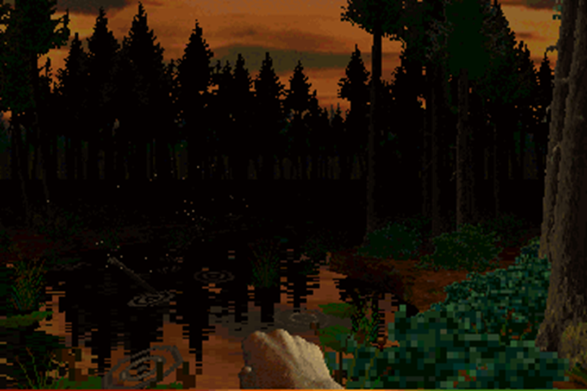
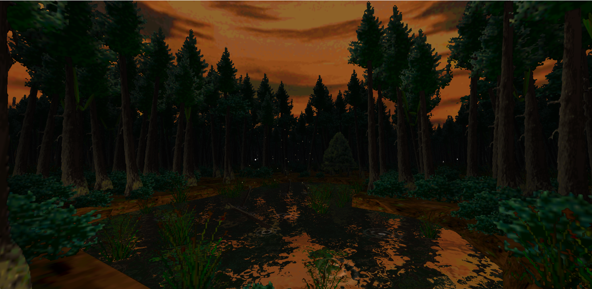
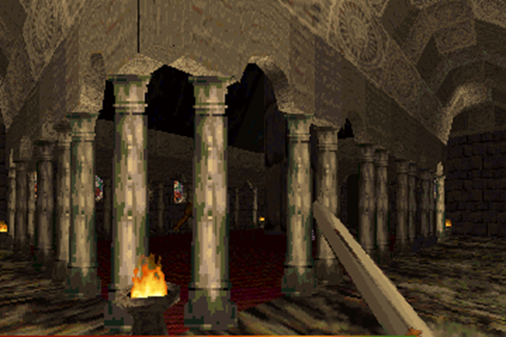
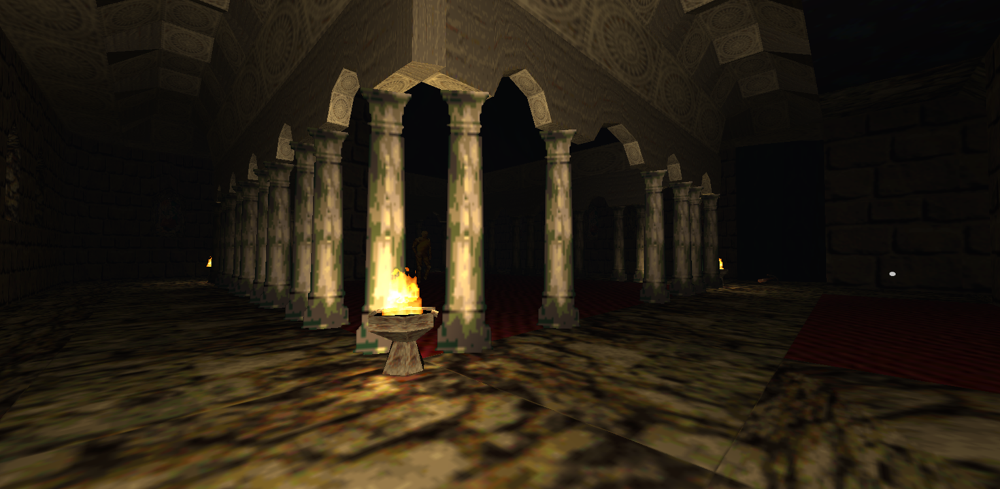

# The New Renderer

This chapter provides a bit more information about the new renderer efforts for Desperabis. It was a fun project to see how all the old assets do look with a modern renderer at high resolution and high framerate.

Here are some direct comparisons:

| Original game         | New renderer          |
|-----------------------|-----------------------|
|  |  |
|  |  |

Note that the new renderer does not run the game. It's just a visualization of the old assets that you can explore with a free camera.

## Important

- This repository includes pre-built executable files.
- While the executables have been tested, you use it **at your own risk**.
- Please review the source code and build it yourself if you have any concerns about security or reliability.

## Renderer Source Code

The full self-contained source code of the new renderer is part of this repo in the [Source/NewRenderer](Source/NewRenderer) folder. It's a C++ project that uses DirecX11 for rendering (I also made a OpenGL ES backend, but that one lacks some key rendering effects). You can build and run it from source code. There are also a pre-built versions of the `Release` configurations in the `Bin` folder of this repo that can be used. Note that these executables are self-contained with all required assets dependencies compiled into it.

The renderer cannot be considered a fully fledged game engine since for the most parts it's designed around the very specific Desperabis assets. However, some key concepts (Scene, Visibility, Renderer,...) are kept more generic. If you are new to graphics rendering, and you want to build your own small game engine, you might find some useful parts.

If you find any bugs or if you have any ideas for extension, feel free to contribute or reach out to me here on github.
