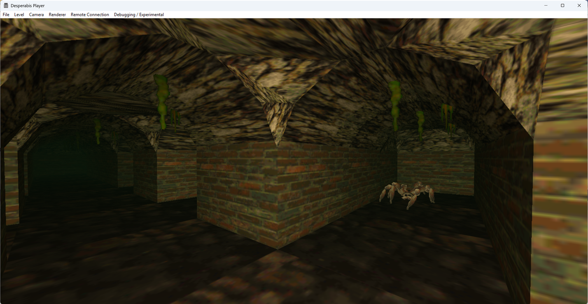

# The New Renderer

This chapter provides a bit more information about the new renderer efforts for Desperabis. It was a fun project to see how all the old assets do look with a modern renderer at high resolution and high framerate.

Here are some direct comparisons:

| Original game         | New renderer          |
|-----------------------|-----------------------|
|  |  |
|  |  |

Note that the new renderer does not run the game. It's just a visualization of the old assets that you can explore with a free camera.

## Important

- This repository includes pre-built executable files.
- While the executables have been tested, you use it **at your own risk**.
- Please review the source code and build it yourself if you have any concerns about security or reliability.

## The Desktop Player

The `Desperabis-DesktopPlayer.exe` is a standalone Windows application that runs the new renderer in a desktop window.

You can use it to explore all 25+ levels in Desperabis with a free camera.
Within the window, you can navigate the free camera with the `WASD` keys and look around with the mouse.
You can also use the mouse for the menu bar, where you can change the level, camera modes, and a few rendering capabilities.

## The OpenXr Player

The `Desperabis-OpenXr-DX11.exe` runs on Windows dektop, too, but instead renders into an offscreen target to be used for OpenXr applications. Accordingly, an OpenXr runtime needs to be installed, otherwise the exe will exit with an error message right away.

The use case that I had in mind was using Desperabis through [Meta Quest's built-in live link feature](https://www.meta.com/help/quest/articles/headsets-and-accessories/oculus-link/connect-with-air-link).

It works great!

<video src="media/quest-live-link-level20.mp4" loop autoplay muted playsinline>
  Your browser does not support the video tag.
</video>

To try it out yourself, start the `Desperabis-OpenXr-DX11.exe` while the Quest OpenXr runtime is installed (see online documentation linked above). You should find yourself in a Desperabis level at room scale. You can move around with the thumbstick and toggle the levels with the `X` and `Y` controller buttons.

The logic for the key mappings is in file: `Source\NewRenderer\DesperabisOpenXr-DX11\Source\DesperabisOpenXrCamera.cpp`.

## Source Code

The full self-contained source code of the new renderer is part of this repo in the [Source/NewRenderer](Source/NewRenderer) folder. It's a C++ project that uses DirecX11 for rendering (I also made a OpenGL ES backend, but that one lacks some key rendering effects). You can build and run it from source code. There are also a pre-built versions of the `Release` configurations in the `Bin` folder of this repo that can be used. Note that these executables are self-contained with all required assets dependencies compiled into it.

The renderer cannot be considered a fully fledged game engine since for the most parts it's designed around the very specific Desperabis assets. However, some key concepts (Scene, Visibility, Renderer,...) are kept more generic. If you are new to graphics rendering, and you want to build your own small game engine, you might find some useful parts within the code.

While the renderer source code is well structured, the code for the OpenXr sample wrapper is quite a mess! I apologize for that. The reason is that I wanted to get the "Hello Xr" sample from the Khronos Group up and running as quickly as possible. So I just hacked in the Desperabis renderer.

If you find any bugs or if you have any ideas for extension, feel free to contribute or reach out to me here on github.
