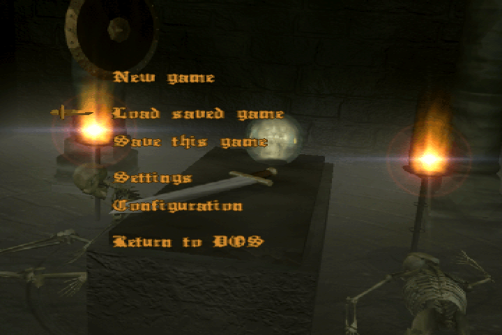

# Desperabis

Hello adventurers and friends of good old DOS games!

Back in the times when file extensions still had 3 characters, and the full game assets were smaller than an average exception string output today, good games existed. This is the story of


In this article:
- [Desperabis](#desperabis)
  - [About](#about)
    - [About the Author](#about-the-author)
    - [About the Game](#about-the-game)
    - [Source Code](#source-code)
    - [License](#license)
  - [Running the Game](#running-the-game)
    - [Dosbox Settings](#dosbox-settings)
    - [English Version](#english-version)
    - [Savegames](#savegames)
    - [Walkthrough](#walkthrough)
  - [Localization](#localization)
  - [Music](#music)
  - [Contributing](#contributing)
  - [Future Plans](#future-plans)

## About

_Desperabis_ is a DOS-based 3D adventure game, published in 1999. It had been downloaded multiple hundred thousand times and it has also been on numerous cover disks of well known print magazines.

Here are some in-game impressions:

|  |  |
| ---------------------------------------------------------- | ---------------------------------------------------------- |

Other 3D games had been on the market for years already, but _Desperabis_ was acclaimed for its dense atmosphere, embedded into a captivating story. Creepy atmosphere instead of splatter! Hitchcock, not Saw.

Beside the unique atmosphere, it came up with some not-so-common rendering features, such as dynamic lighting or water reflections.

The fact that MS-DOS games were declining in 1999 already (in favour of hardware accelerated Windows games), caused _Desperabis_ to get less recognition than it could have gotten a few years earlier. But most importantly, it was mostly limited to German speaking market, since the whole game was exclusively in German language.

However, this is one of the reasons why I created this repo: Reverse engineering and re-packaging the assets now allows us to create an [English localization](readme.md#english-version) of the game. Special Kudos to user [@Sir John](https://github.com/ungesundes-halbwissen), who came up with the initial idea of a language port and who did all the translation work!

### About the Author

My name is Florian Born and I'm a computer graphics enthusiast since my first computer, a C64 in the year 1984! When I looked at games, I was always more interested in _how_ they worked rather than playing them. I then started writing smaller games myself, soon exploring the fascinating new worlds of 3D graphics. Since there had barely been any 'online' (what is this new internet anyway?!) resource about how to write a renderer, I learned on the job.

I have stayed within the industry since then. Today, I'm working as a development lead in the VR space.

### About the Game

_Desperabis_ was my first game that can be considered finished. It was written in the years 1996-1999, started as a pet project alongside my studies and soon evolved due to overwhelming feedback. Programming-wise, at the time I hadn't transitioned to C/C++, so the game was written in Turbo Pascal 7.0 with major parts hand-optimized through inline assembler.

Due to the lack of affordable(!) industry standards for 3D tooling, I wrote all the tools myself: A texture editor, a 3D modeling/animation tool, and an in-game level/mission editor. Unfortunately, it's all gone - see next paragraph.

### Source Code

Before you ask: No, I lost it!

It's a pity because it would have allowed me to do a full port of the game to modern graphics, including the gameplay code. Anyway, reverse engineering all the asset parts was a fun endeavor, as it brought back all the good memories!

### License

This repo is Open Source using the permissive "MIT License", which essentially means you can do whatever you like with it, as long as you include the original copyright and license notice in any copy of the code or a substantial portion of it. See [License file here](LICENSE).

## Running the Game

Given that _Desperabis_ is a pure MS-DOS game, it needs to run in an emulator, such as famous [DosBox](https://www.dosbox.com/). The self-contained game binaries is part of this repo and can be found here: [Game/Original](Game/Original).

### Dosbox Settings

DOSBox comes with various options to tweak the performance. It turns out that the default options are not too well suited and cause the game to run in very low framerate and with stuttering sound. It's not only necessary to increase the number of CPU cycles, but also to set the core to 'dynamic'. The following settings work well for me:

```ddl
core=dynamic
cputype=auto
cycles=fixed 800000
```

Individual settings might vary in the sweet spot for the cycle count (increase/decrease while the game is running and find a good number where the game runs fluently _and_ the sounds plays flawlessly). But the `core=dynamic` part is crucial for acceptable performance.

You can put these settings into DOSBox' config file (under the [cpu] tag).

It's also advisable to mount the directories to point to the DESPERAB.EXE. I added this to the `autoexec` section of the .conf file:

```ddl
[autoexec]
# Lines in this section will be run at startup.
# You can put your MOUNT lines here.
mount d <path to Desperabis repo>\Game\Original
mount e <path to Desperabis repo>\Game\English
```

...just so I can switch to drive `D:` for the original version and `E:` for the English version. `<path to Desperabis repo>` needs to be replaced by the absolute path of your local checkout of the Desperabis repo.

### English Version

An English version of the original game can be found here: [Game/English](Game/English). See [localization chapter](#localization) for more information about how this was done.

### Savegames

This repo comes with a bunch of save games, essentially one for every level in the game. The files are located within the [Data/SaveGames](Data/SaveGames) folder of this repo.

To use them, you need to copy them next to the DESPERAB.EXE in the games folder. Since the in-game UI is limited to listing only 10 files at a time (named STAND1..10.SPL), they are grouped in folders and you need to copy them over the existing 10 files.

### Walkthrough

Back in the days, I wrote a walkthrough in German language. Thanks again [@Sir John](https://github.com/ungesundes-halbwissen) for restoring, correcting, and providing an English version of it. You can find the walkthrough documentation here:

- [German walkthrough](Docs/Walkthrough/Walkthrough-German.md)
- [English walkthrough](Docs/Walkthrough/Walkthrough-English.md)

## Localization

The original game was in German language and it had not been designed with localization in mind. Accordingly, localization would have been quite tedious, by editing the binary files with a hex editor. This would have been difficult enough for all the texts, but impossible for the graphics that need localization. Note that patching a binary file requires that you get along with the same number of characters/bytes, or fewer.

That's when I decided to write a simple tool that extracts/converts the game binaries to standard formats (.txt for texts, .tga for graphics, .wav for sound) and then allows to re-pack them to a runnable EXE/data files. The result of the English translation can be found here: [Game/English](Game/English).



The C++ source code of the conversion tool is part of this repo. It's a self-contained Visual Studio solution [here](Source/).

With this simple workflow, it's now straight-forward to create other localizations as well. Just contact me if you are interested.

## Music

When creating the game, I was looking for a good fit for royalty-free music that I can use. It was just good coincidence that a close friend of mine recorded their own music CD, the album "Et". I got permissions to put the [full album on YouTube](https://www.youtube.com/watch?v=AVbM_BTHybo&list=PLmkuT--rMY1qd7M4o5UknBGlGjppDSUeU&index=1). For completeness, .mp3 files in high quality and full length are also stored in this repo: [Data/Menestrels](Data/Menestrels).

## Contributing

Any feedback and/or contribution is highly appreciated! Feel free to fork this repo and make contributions via pull requests.

## Future Plans

I have written a new renderer that uses the old assets as is. I'm in the process of cleaning it all up and then I'll release it here. 

A lot more to come very soon, stay tuned!
